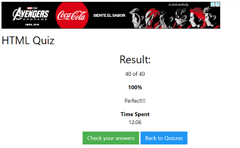

# * Google Tag

Google Tag Manager es un sistema de gestión de etiquetas creado por Google para administrar las etiquetas de JavaScript y HTML utilizadas para el seguimiento y análisis de sitios web.

# * Quiz HTML

HTML hace referencia al lenguaje de marcado para la elaboración de páginas web.

# * Quiz CSS

s un lenguaje de diseño gráfico para definir y crear la presentación de un documento estructurado escrito en un lenguaje de marcado.​ 

     
.
